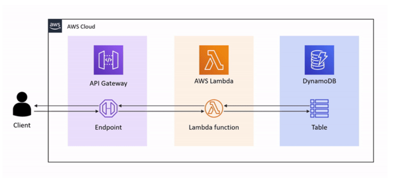

# PyRestApi CDK Project

This project deploys a serverless REST API on AWS using AWS CDK (Cloud Development Kit) in Python. The API leverages API Gateway, Lambda functions, and DynamoDB to provide a simple REST interface for managing employee records.

## Architecture


## Features

- **API Gateway**: Exposes a REST API with CORS enabled, allowing GET and POST methods.
- **Lambda Function**: Processes API requests to add new records or fetch existing records by ID.
- **DynamoDB Table**: Stores employee data, with an auto-generated unique ID for each record.

## Project Structure

- **`app.py`**: Entry point for the CDK application.
- **`PyRestApiStack`**: Defines the AWS resources and connections between them.
- **`services/index.py`**: Lambda function handler and supporting functions.

## Stack Components

- **DynamoDB Table**: Named `EmplTablePy`, with `id` as the partition key, and provisioned for on-demand billing.
- **Lambda Function**: Named `EmplLambda`, using Python 3.11 runtime. Configured with environment variables to access the DynamoDB table and uses `index.handler` as the entry point.
- **API Gateway**: Exposes the REST API with two endpoints:
  - **POST /empl**: Adds a new employee record.
  - **GET /empl?id={id}**: Fetches an employee record by `id`.

## Usage

**Base URL**: `https://51pl8svxec.execute-api.us-east-1.amazonaws.com/prod/`

1. **POST /empl**  
   Add a new employee record.  

   - **Endpoint**: `POST https://51pl8svxec.execute-api.us-east-1.amazonaws.com/prod/empl`
   - **Request Body (JSON)**:
     ```json
     {
       "name": "John Doe",
       "position": "Software Engineer",
       "department": "Engineering"
     }
     ```
   - **Response (JSON)**:
     ```json
     {
       "id": "generated-unique-id"
     }
     ```

2. **GET /empl?id={id}**  
   Fetch an employee record by ID.

   - **Endpoint**: `GET https://51pl8svxec.execute-api.us-east-1.amazonaws.com/prod/empl?id={id}`
   - **Query Parameter**: `id` (UUID of the employee record)
   - **Response (JSON)**:
     ```json
     {
       "id": "generated-unique-id",
       "name": "John Doe",
       "position": "Software Engineer",
       "department": "Engineering"
     }
     ```
   - **Error Response**:
     - Status Code: `404 Not Found`
     - Response Body:
       ```json
       {
         "error": "Not found"
       }
       ```


## Lambda Code Overview

The Lambda handler function (`index.handler`) processes incoming HTTP requests based on the method:

- **POST**: Calls `add_new_item()` to insert a new record with a generated UUID.
- **GET**: Calls `get_item_by_id()` to retrieve a record by its unique ID.
- **Helper Functions**: 
  - `generate_response()`: Standardizes API responses with CORS headers.
  - `add_new_item()` and `get_item_by_id()`: Interact with DynamoDB.

## Deployment Instructions

1. **Install AWS CDK**  
   ```bash
   npm install aws-cdk # Installing locally
2. **create and activate a Virtual Environment (Optional but recommended)**
    ```bash
    python3 -m venv .venv && source .venv/bin/activate

3. **Install Python dependencies**  
   ```bash
   pip install -r requirements.txt
   
4. **Deploy the stack**  
   ```bash
   ./node_modules/aws-cdk/bin/cdk bootstrap # Only first time
   ./node_modules/aws-cdk/bin/cdk deploy

## References
This project was inspired by the Udemy course:  
**[Course Title:AWS CDK for professionals (Python and TypeScript)](https://www.udemy.com/course/aws-cdk-for-professionals/)**  
by [Alex Dan]

